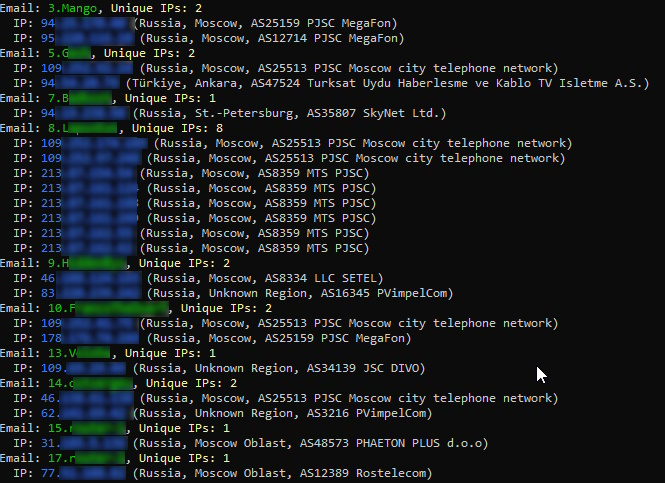

# Xray Access View (DEV)


**Xray Access View** — это утилита для анализа логов Xray, которая позволяет:

- **Анализ подключений:** Просматривать к каким доменам какие Xray Email получали доступ.
- **Визуальное выделение:** Российские домены автоматически подсвечиваются красным.
- **Режим сводки:** Определять уникальные IP-адреса, ассоциированные с каждым Email.
- **Гео база:** Определяет у каждого IP адреса Регион, Город и AS провайдера.
- **Поддержка панелей:** Поддерживается чтение логов Marzban и Remnavawe.
---

## Особенности

- **Гибкость:** Укажите кастомный путь к логам или используйте путь по умолчанию (`/var/lib/marzban/access.log`).
- **Чтение логов Remnanode:** Скрипт автоматически берет логи из контейнера с нодой и копирует их в `/var/remnalogs/access.log` 
- **Режимы отображения:**
  - **Основной режим:** Отображает список доменов и IP-адресов по каждому Email.
  - **Режим сводки:** С помощью параметра `--summary` выводит только уникальные IP-адреса для каждого Email.

---

## Установка и использование

### Установите python и geoip2
```
apt update 
apt install python3
apt install python3-geoip2 python3-pip
python3 -m pip install --break-system-packages textual
```
> [!WARNING]
> При первой установке пакетов может потребоваться перезагрузка системы через команду `reboot`

### Запуск в основном режиме
```bash
python3 <(curl -sL https://github.com/Davoyan/xray-access-view/raw/dev/view.py)
```


### Запуск в основном режиме с выводом не только доменов, но и ip
```bash
python3 <(curl -sL https://github.com/Davoyan/xray-access-view/raw/dev/view.py) --ip
```

### Запуск в режиме сводки
```bash
python3 <(curl -sL https://github.com/Davoyan/xray-access-view/raw/dev/view.py) --summary
```


### Запуск в режиме сводки, с выводом только тех ip, что сейчас подключены к серверу
```bash
python3 <(curl -sL https://github.com/Davoyan/xray-access-view/raw/main/view.py) --online
```
---
#### Доступ к логам Marzban
По умолчанию используется путь '/var/lib/marzban/access.log', если вы хотите использовать свой путь, во время запуска скрипта следуйте следующему:
```
Укажите путь до логов (нажмите Enter для использования '/var/lib/marzban/access.log'): /my/path/access.log
```

В конфигурации xray у вас должены быть прописаны access логи, пример:
```Пример
"log": {
    "access": "/var/lib/marzban/access.log",
    "loglevel": "warning",
},
```

